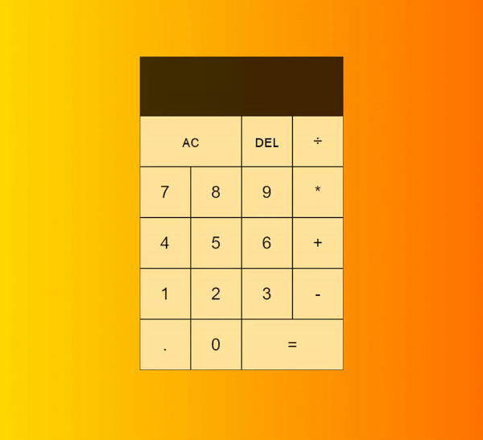

# serafin_ewa_eks_195ICA
 zaliczenie eks

## 1. Aplikacja ToDo

## 2. Aplikacja kalkulator

## 3. Aplikacja galeria zdjęć

## 4. Aplikacja wyszukiwanie fraz w zasobach internetu.

## 5. Aplikacja blog
## [Link do repozytorium z blogiem](https://github.com/serafinewa/aplikacje-inte-22665-195IC) [<--- ]
